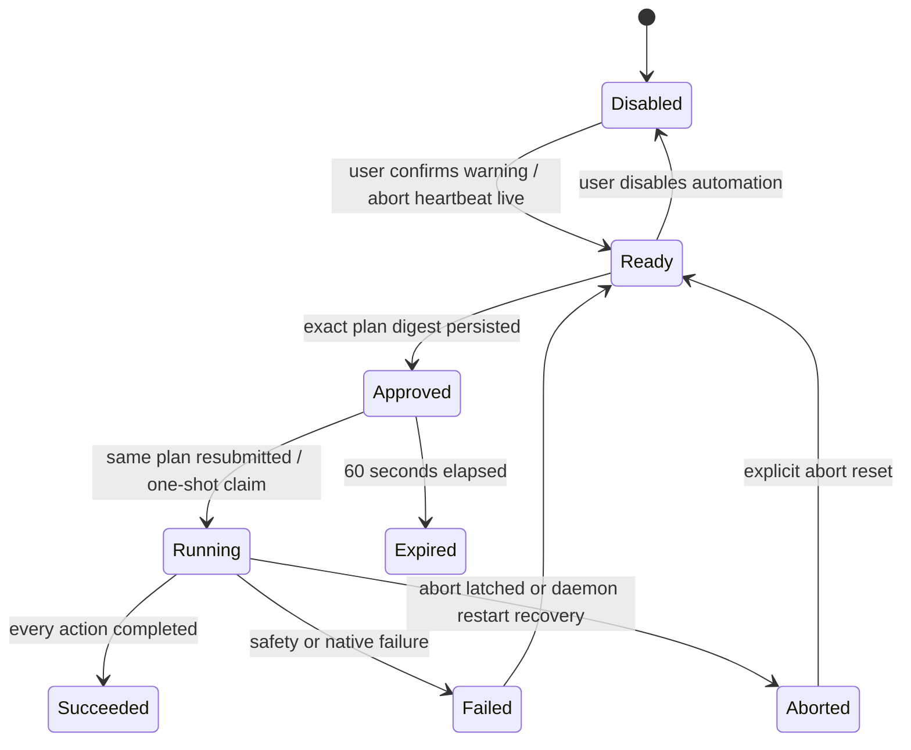

# P4 Guarded Automation V1

Status: approved implementation contract  
Owner: daemon  
Default: disabled

## Scope

Guarded Automation V1 lets a user manually construct and approve a short deterministic plan for
the currently foreground Windows application. It is not an agent loop and never derives actions
from generated text. The supported actions are:

| Action | Selector/input | Native mechanism |
| --- | --- | --- |
| `uia_invoke` | Exact Automation ID | UI Automation Invoke pattern |
| `uia_set_value` | Exact Automation ID and value | UI Automation Value pattern |
| `key_chord` | Typed modifiers and key | `SendInput` |
| `type_text` | Unicode text | `SendInput` UTF-16 events |

Mouse coordinates, clipboard access, shell commands, arbitrary virtual-key integers, the Windows
key, and implicit UIA-to-keyboard fallback are not supported.

## Bounds

- A plan contains 1–10 actions.
- Each selector, value, or text field contains 1–512 Unicode scalar values.
- A plan targets one HWND, PID, executable name, and display title captured together.
- Approval expires after 60 seconds and can start one run only.
- Execution is single-flight and stops after 10 seconds.
- Native input actions are separated by at least 100 milliseconds.
- The fixed emergency abort shortcut is `Ctrl+Alt+Shift+Esc`.
- The shell heartbeat interval is 3 seconds; a heartbeat older than 10 seconds is stale.

The display title is shown in the approval UI but is not persisted in the automation ledger. The
target executable is normalized to a bounded file name before it crosses IPC.

## Lifecycle



Enablement, approval, and execution are separate user actions. Capturing a target and executing a
plan temporarily hide ScreenSearch so the external application can regain the foreground.

## Safety checks

Before approval, the daemon requires automation enabled, a fresh abort heartbeat, abort not
latched, an unlocked session, and a foreground target that exactly matches the plan.

Before starting and immediately before every action, the daemon repeats:

1. enabled-state check;
2. abort-heartbeat freshness check;
3. abort-latch check;
4. known-unlocked interactive-session check;
5. exact HWND, PID, and executable-name match;
6. plan deadline check; and
7. action pacing check.

Any failed or unknown check stops the run. UI Automation selectors must resolve to exactly one
descendant of the approved HWND and must expose the requested pattern. Keyboard emission never
tries to elevate or bypass Windows integrity boundaries.

## Persistence and privacy

`automation_settings_v1` stores only the default-off enabled bit. `automation_run_v2` stores:

- approval/run identifier;
- canonical BLAKE3 plan digest;
- action count;
- lifecycle status;
- approved, expiry, started, and finished timestamps; and
- a stable content-free failure code.

The database never stores the target title, HWND, PID, executable, UI Automation ID, text value,
typed text, key sequence, or serialized plan. A daemon restart converts orphaned `running` rows to
`aborted`.

## Stable failure codes

`disabled`, `abort_unavailable`, `abort_active`, `approval_missing`, `approval_expired`,
`plan_mismatch`, `target_changed`, `session_locked`, `rate_limited`, `timeout`, `input_blocked`,
`control_missing`, `control_ambiguous`, and `control_unsupported`.

The UI may add human-readable explanations, but IPC and persistence use these stable values.

## Manual verification

The gated Windows fixture may operate only on a synthetic test window created by the fixture. It
must verify invoke, set-value, keyboard fallback, focus rejection, timeout, and global abort. The
test must never locate or control unrelated applications.

Implemented fixture command:

```powershell
$env:SCREENSEARCH_RUN_AUTOMATION_IT='1'
cargo test -p screensearch-windows guarded_windows_automation_fixture_exercises_native_paths -- --ignored --nocapture
```

The committed fixture verifies UIA set-value, UIA invoke, UTF-16 text input, key-chord fallback,
and foreground rejection against its owned synthetic Win32 window.

The fixture drives the native adapter directly and therefore does **not** exercise the daemon
approval/execute flow. The end-to-end approval path can only be confirmed manually:

1. Run `npm run tauri dev` against a running daemon, open Guarded automation, accept the warning,
   and Enable.
2. Capture a target (e.g. Notepad), build a `type_text` action, and **Approve** — this must
   succeed (before the 2026-06-23 fix it always failed with `target_changed` because the shell did
   not yield the foreground during approval).
3. **Execute approved** and confirm the text reaches the target application.
4. Press `Ctrl+Alt+Shift+Esc` during a run and confirm the abort latches.
5. With the abort shortcut held by another application, confirm the abort pill reads
   "Unavailable" (not merely a blank/"Reconnecting" state) and that automation cannot be enabled.

## Review follow-ups (2026-06-23)

- The shell hides its window for capture, **approve**, and execute (a shared helper) so the
  external target is foreground during the daemon's identity checks.
- The canonical plan digest binds to target identity (PID/HWND/lowercased executable) and the
  ordered actions only; `display_title` is excluded so a retitle does not cause `plan_mismatch`.
- The abort shortcut registration is re-asserted on every heartbeat; the status reports
  `heartbeat_fresh` and `abort_registered` so the UI can tell "hotkey unavailable" from "daemon
  reconnecting".
- Abort and the execution deadline stop the run *between actions*; a single native action is one
  syscall and finishes before the run stops (a bounded one-in-flight residual).
